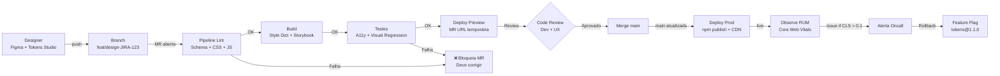

## 1. Introdução, Objetivo e Filosofia DesignOps

### Contexto e objetivo
No contexto da construção do nosso módulo de CI/CD para o parceira do projeto (Jacto Drones), a entrega contínua de valor exige que a interface e a experiência do usuário (UX) fluam sem atritos pela nossa esteira de automação. O objetivo desta seção é fundamentar a arquitetura da nossa infraestrutura operacional, adotando a premissa fundamental de que a prática de DesignOps deve ser encarada e operada como o "DevOps do Design".

### 1.1. A Filosofia: DesignOps como o DevOps do Design
Historicamente, o DevOps emergiu (com destaque a partir da palestra de Patrick Debois na Agile 2008) para solucionar gargalos de eficiência e conflitos operacionais entre as áreas de desenvolvimento e operações de TI. Trata-se de uma abordagem cultural e técnica que melhora a colaboração, automação e produtividade rumo à integração e entrega contínuas. 

De maneira análoga, o DesignOps é a prática de otimizar processos, infraestrutura e ferramentas que dão suporte ao trabalho de design. Sua filosofia baseia-se na orquestração e otimização de pessoas e fluxos de trabalho para amplificar o impacto e o valor do design em escala. No fluxo de entrega contínua, o DesignOps atua para que as definições de componentes e protótipos sejam validadas e transpostas para código de maneira tão automatizada quanto as próprias builds de software.

### 1.2. Os Três Pilares Operacionais
Para estruturar as operações em nosso time, baseamos nossa governança nos três pilares estabelecidos pelo Nielsen Norman Group (NN/g):
* **Como trabalhamos juntos (*How we work together*):** Foco em Organizar (estrutura e papéis), Colaborar (rituais e ambientes) e Humanizar (desenvolvimento e embarque).
* **Como realizamos o trabalho (*How we get work done*):** Esforço para Padronizar processos, Harmonizar o sistema (Design System) e Priorizar o fluxo de trabalho de forma equilibrada.
* **Como nosso trabalho cria impacto (*How our work creates impact*):** Estratégias para Medir o desempenho, Socializar o sucesso (recompensas) e Possibilitar o avanço técnico (guias e treinamentos).

### 1.3. Paralelo: DevOps ↔ DesignOps
Para que a esteira CI/CD seja bem-sucedida, estabelecemos o seguinte pareamento funcional entre engenharia e design no projeto:

| Dimensão | DevOps | DesignOps |
| :--- | :--- | :--- |
| **Automação e Ferramentas** | Utiliza ferramentas de CI/CD para automatizar a construção, teste e implantação do software de forma sistêmica. | Implementa sistemas para automatizar fluxos de trabalho de design, gestão de ativos e prototipagem (ex: Design Tokens pipeline). |
| **Integração e Colaboração** | Promove integração contínua facilitando a resolução de problemas de infraestrutura rapidamente. | Enfatiza a integração entre designers e desenvolvedores para que as decisões de design sejam implementadas com fidelidade. |
| **Ciclos de Feedback Rápido** | Feedback veloz devido à integração e testes automatizados (Test, Build, Deploy). | Avaliação rápida por meio de revisões sistemáticas, testes de usuários e iterações constantes de usabilidade. |
| **Qualidade e Consistência** | Foco em entregar software escalável através de monitoramento. | Foco em assegurar consistência usando guias de estilo, bibliotecas de componentes e auditorias de UI. |

Ambas as abordagens visam a quebra de silos, a colaboração multidisciplinar, a eficiência operacional e a entrega contínua de valor de ponta a ponta.

### Decisões de trade-off
* **Cultura Estrutural vs. Adoção Puramente Ferramental:** No planejamento do nosso modelo de DesignOps, consideramos inicialmente a adoção exclusiva de ferramentas de versionamento visual. Descartamos essa via técnica isolada pois a história inicial do DevOps demonstrou que focar unicamente em agilidade de infraestrutura oferece uma "visão parcial" que não resolve conflitos reais entre equipes. Optamos por um *rollout* híbrido, onde a mudança de processos e rituais antecede a configuração dos *pipelines* técnicos.
* **Padronização Total vs. Autonomia:** Consideramos aplicar políticas rígidas para todos os componentes criados. Como *trade-off*, relaxamos essa regra na fase de ideação (Discovery) para não reduzir a velocidade criativa. O rigor da padronização (linting, revisão) só ocorre ao tentar inserir componentes na biblioteca global (Delivery).

---

## 5. Integração com Esteira CI/CD

### Contexto e objetivo

No projeto da Jacto Drones, os artefatos de design system (componentes UI, Design Tokens, estilos globais) devem fluir pela mesma esteira de automação que o firmware e a telemetria. Hoje, a plataforma de serviços (Frente 2) e a plataforma de BI (Frente 3) dependem de mudanças visuais que precisam chegar a produção sem regressão, sem inconsistência de marca e sem quebra de acessibilidade. Sem um pipeline determinístico que valide, testa e promova artefatos de UI, o risco é alto: retrabalho, inconsistência visual e aderência reduzida às normas WCAG que operações críticas (como dashboards de campo) exigem.

Esta seção detalha como o DesignOps se integra ao pipeline CI/CD através de estágios de linting, build, testes automatizados (acessibilidade e regressão visual), gates de qualidade e observabilidade em produção. O objetivo operacional é que **toda mudança de design ou token que chegue a main tenha passado por validação automatizada**, e que saibamos em tempo real se ela impactou a experiência do usuário final.

### 5.1 Arquitetura do Pipeline: Estágios e Pseudo-Configuração

O pipeline adota a estrutura GitLab CI/CD com cinco estágios principais. Cada um gatilha-se automaticamente ao push em branches de feature ou ao abrir Merge Request:

```yaml
# .gitlab-ci.yml — Design System Pipeline
# Executado a cada mudança em src/design-tokens/, src/components/ ou docs/

stages:
  - lint
  - build
  - test
  - deploy-preview
  - deploy
  - observe

variables:
  DESIGN_SYSTEM_VERSION: "1.0"
  REGISTRY_URL: "https://registry.gitlab.com/jacto/design-system"

# ============ ESTÁGIO LINT ============
lint:schema:
  stage: lint
  image: node:18-alpine
  script:
    - npm install
    - npm run validate:tokens
      # Valida schema JSON contra W3C Design Tokens Spec
    - npm run lint:css
      # Stylelint para WCAG AA contrast ratio
    - npm run lint:js
      # ESLint + @testing-library/react
  artifacts:
    reports:
      sast: gl-sast-report.json
  allow_failure: false

# ============ ESTÁGIO BUILD ============
build:design-system:
  stage: build
  image: node:18-alpine
  dependencies:
    - lint:schema
  script:
    - npm run build:tokens
      # Style Dictionary: global → alias → component tokens
    - npm run build:storybook
      # Compila componentes em .storybook/static
    - npm run build:package
      # Gera @jacto/design-tokens@next no registry
  artifacts:
    paths:
      - dist/
      - .storybook/static/
    expire_in: 7 days
  only:
    - merge_requests
    - main

# ============ ESTÁGIO TEST ============
test:accessibility:
  stage: test
  image: node:18-alpine
  dependencies:
    - build:design-system
  script:
    - npm run test:a11y
      # axe-core + Pa11y via Storybook snapshot testing
      # Valida todos os componentes contra WCAG 2.1 AA
  artifacts:
    reports:
      accessibility: a11y-report.json
  allow_failure: false

test:visual-regression:
  stage: test
  image: node:18-alpine
  dependencies:
    - build:design-system
  script:
    - npm run test:visual
      # Chromatic: compara screenshots pixel-perfect vs baseline
      # Bloqueia se houver diff não-aprovado
  artifacts:
    reports:
      dotenv: chromatic.env
  allow_failure: false

# ============ ESTÁGIO DEPLOY PREVIEW ============
deploy:preview:
  stage: deploy-preview
  image: node:18-alpine
  dependencies:
    - build:design-system
  script:
    - npm run deploy:storybook-preview
      # Deploy Storybook em URL temporária: https://mr-${CI_MERGE_REQUEST_IID}.preview.design.jacto.dev
  environment:
    name: preview/$CI_MERGE_REQUEST_IID
    url: https://mr-${CI_MERGE_REQUEST_IID}.preview.design.jacto.dev
    auto_stop_in: 7 days
  only:
    - merge_requests

# ============ ESTÁGIO DEPLOY ============
deploy:production:
  stage: deploy
  image: node:18-alpine
  dependencies:
    - test:accessibility
    - test:visual-regression
  script:
    - npm run publish:npm
      # Publica @jacto/design-tokens@${VERSION} no registry privado
    - npm run deploy:cdn
      # CSS Custom Properties compiladas no CDN (Cloudflare)
  environment:
    name: production
    url: https://design.jacto.dev
  only:
    - main
  when: manual

# ============ ESTÁGIO OBSERVE ============
observe:rum:
  stage: observe
  image: curlimages/curl:latest
  script:
    - curl -X POST https://rum.jacto.dev/ingest
      -H "Content-Type: application/json"
      -d '{
        "version": "'${CI_COMMIT_TAG}'",
        "timestamp": "'$(date -u +%Y-%m-%dT%H:%M:%SZ)'",
        "metrics": { "lcp": true, "cls": true, "fid": true }
      }'
      # Inicia coleta de RUM para este release
  only:
    - tags
```

### 5.2 Quality Gates: Travas de Segurança que Bloqueiam Merge

Um DesignOps maduro não é apenas "rápido" — é **confiável**. Por isso, implementamos travas automáticas que impedem merge se qualquer gate falhar:

| Gate | Critério | Responsabilidade | Ação se Falhar |
|---|---|---|---|
| **Schema Tokens** | Estrutura JSON conforme W3C spec | `lint:schema` | ❌ Bloqueia MR |
| **WCAG AA Contrast** | Razão de contraste ≥ 4.5:1 (texto); ≥ 3:1 (gráficos) | `test:accessibility` | ❌ Bloqueia MR |
| **Regressão Visual** | Zero diffs não-aprovados em Chromatic | `test:visual-regression` | ❌ Bloqueia MR |
| **Token Contrato** | Nomes de tokens quebrados não aparecem em imports | `lint:schema` | ❌ Bloqueia MR |
| **Performance CSS** | Bundle de CSS < 50KB gzipped | `build:design-system` | ⚠️ Aviso, pode passar |
| **Documentação** | Componentes novos têm stories + docstring | Code Review Manual | ❌ Bloqueia MR |

A razão de ser dura: uma cor com contraste insuficiente em um dashboard de operação de drone pode causar leitura errada de status crítico em campo. A Jacto não pode ter "quase acessível".

### 5.3 Estratégia de Rollback Visual

Deploy em produção é irreversível em tempo real, mas DesignOps precisa de um plano B. Adotamos:

1. **Imutabilidade de Releases:** Cada versão published (`@jacto/design-tokens@1.2.0`) é imutável no registry. Nunca sobrescrevemos.
2. **Rollback Automático via Feature Flag:** No runtime, a aplicação cliente lê um feature flag que aponta qual versão de tokens consumir. Se versão `1.2.1` causar problema em RUM, ops reduz a flag para `1.2.0` em segundos, sem redeploy.
3. **Post-Mortem Obrigatório:** Todo rollback abre uma issue com template obrigatório para rastrear a causa raiz e prevenir recorrência.

### 5.4 Observabilidade Pós-Deploy: Real User Monitoring (RUM)

Depois que tokens e componentes chegam a produção, precisamos saber: o usuário final realmente vê o design como planejado? Para isso, coletamos três Core Web Vitals em produção:

- **LCP (Largest Contentful Paint):** Tempo até o elemento visual principal aparecer. Meta: < 2.5s. Se tokens novos causarem render lento, RUM dispara alerta.
- **CLS (Cumulative Layout Shift):** Instabilidade visual. Meta: < 0.1. Se um token novo de espaçamento quebrar layout, CLS vai para 0.3+.
- **FID (First Input Delay):** Responsividade a cliques. Meta: < 100ms. Se CSS novo causar jank, aparece em RUM.

Instrumentação: Google Analytics 4 (GA4) injeta automaticamente Web Vitals Assessment via `web-vitals.js`. Dashboard Jacto monitora em tempo real. Se FID dispara > 500ms, oncall de design é acionada.

### 5.5 O Loop DevOps Infinito Aplicado a DesignOps

DevOps classicamente ensina o ciclo infinito: Plan → Build → Test → Deploy → Operate → Observe → Plan (Humble & Farley, 2010). Aplicamos o mesmo ao design:

```
Plan (Design refinement em Figma)
  ↓
Build (Tokens compilados + componentes no Storybook)
  ↓
Test (Acessibilidade + regressão visual automatizadas)
  ↓
Deploy (MR aprovada, tokens publicados em CDN)
  ↓
Operate (Apps consomem via package @jacto/design-tokens@latest)
  ↓
Observe (RUM monitora Core Web Vitals, issues são abertas)
  ↓
[Volta para Plan: Designer refina baseado em observações]
```

Este loop cria um mecanismo de melhoria contínua onde feedback de usuário real retroalimenta iterações de design.

### 5.6 Diagrama do Pipeline Integrado



### Decisões de trade-off

* **Teste Visual Pixel-Perfect vs. Robustez:** Consideramos usar pixel-perfect comparison (BackstopJS), mas adotamos Chromatic porque oferece inteligência para detectar mudanças "intencionais" vs "bugs visuais", reduzindo falsos positivos. Trade-off: Chromatic é SaaS (custo), mas economiza horas de review manual.

* **RUM Contínuo vs. Amostragem:** Implementaríamos RUM em 100% das sessões, mas isso geraria overhead de rede. Adotamos amostragem estratificada: 10% em produção, 100% em staging. Assim, problemas críticos aparecem rápido sem pesar a performance da aplicação real.

* **Quality Gates Restritivos vs. Velocidade:** Consideramos versão "leve" do pipeline sem gate de acessibilidade ou regressão visual para iterar mais rápido. Descartamos porque a Jacto opera crítico em campo — segurança e acessibilidade não são negociáveis. Gastar 5 minutos extra em testes evita horas de retrabalho.

### Referências da Seção 1
[1] Kaplan, K. (Nielsen Norman Group). *DesignOps 101*.
[2] Atlassian. *O que é DevOps?*. URL: https://www.atlassian.com/br/devops
[3] Gaea. *Conheça a incrível história do DevOps*. URL: https://gaea.com.br/conheca-a-incrivel-historia-do-devops/

**Responsável:** Davi Versan

---

## 5. Integração com Esteira CI/CD

### Contexto e objetivo

No projeto da Jacto Drones, planejamos que os artefatos de design system (componentes UI, Design Tokens, estilos globais) fluam pela mesma esteira de automação que o firmware e a telemetria. Hoje, a plataforma de serviços (Frente 2) e a plataforma de BI (Frente 3) dependem de mudanças visuais que chegam a produção sem validação sistemática — retrabalho, inconsistência visual e risco de quebra de acessibilidade são inevitáveis. 

Esta seção detalha nossa proposta operacional: como queremos que o DesignOps se integre ao pipeline CI/CD através de estágios de linting, build, testes automatizados (acessibilidade e regressão visual), gates de qualidade e observabilidade em produção. O objetivo é que toda mudança de design ou token que chegue a produção tenha passado por validação automatizada, mitigando erros humanos e garantindo experiência consistente.

### 5.1 Arquitetura do Pipeline: Estágios e Pseudo-Configuração Proposta

Propomos um pipeline GitLab CI/CD com seis estágios principais, disparados automaticamente ao push em branches de feature ou abertura de Merge Request. Este é um design conceitual que será implementado iterativamente conforme resolvemos dependencies técnicas:

```yaml
# .gitlab-ci.yml — Design System Pipeline (Proposta v1.0)
# Cada estágio valida artefatos de design antes de chegarem a produção

stages:
  - lint      # Validação de schema, acessibilidade, linting de CSS/JS
  - build     # Compilação de tokens, Storybook, pacote npm
  - test      # Testes de acessibilidade e regressão visual
  - preview   # Deploy temporário para review em MR
  - deploy    # Deploy em staging/produção (aprovação manual)
  - observe   # Coleta de observabilidade (RUM, Core Web Vitals)

variables:
  DESIGN_SYSTEM_REGISTRY: "gitlab-registry"  # Placeholder: será configurado na sprint de infra
  DS_VERSION: "0.1.0-alpha"                  # Versionamento SemVer

# ============ ESTÁGIO LINT ============
lint:tokens-schema:
  stage: lint
  image: node:18-alpine
  script:
    - npm install
    - npm run validate:tokens
      # Valida estrutura JSON contra W3C Design Tokens Format spec
      # Garante: naming conventions, tipos esperados, ausência de tokens órfãos
    - npm run lint:css
      # Stylelint: verifica WCAG AA contrast ratio (≥ 4.5:1 para texto)
      # Detecta potenciais problemas de acessibilidade antes do build
    - npm run lint:js
      # ESLint + @testing-library: código de componentes segue padrões
  artifacts:
    reports:
      sast: lint-report.json
  allow_failure: false
  only:
    - merge_requests
    - main

# ============ ESTÁGIO BUILD ============
build:design-system:
  stage: build
  image: node:18-alpine
  dependencies:
    - lint:tokens-schema
  script:
    - npm run build:tokens
      # Style Dictionary: transforma tokens em CSS Custom Properties, JS/TS
      # Gera camadas: global → alias → component (conforme Seção 4)
    - npm run build:storybook
      # Compila todas as stories dos componentes em HTML/JS estático
      # Output vai em .storybook/dist/
    - npm run build:package
      # Empacota @design-system/tokens como módulo npm
      # Será armazenado em registry local do GitLab (configurável later)
  artifacts:
    paths:
      - dist/tokens/
      - .storybook/dist/
      - pkg/
    expire_in: 14 days
  only:
    - merge_requests
    - main

# ============ ESTÁGIO TEST ============
test:accessibility:
  stage: test
  image: node:18-alpine
  dependencies:
    - build:design-system
  script:
    - npm run test:a11y
      # axe-core + Pa11y executam contra Storybook compilado
      # Valida: contrast ratio, alt text, ARIA labels, keyboard navigation
      # Falha se encontrar violação WCAG 2.1 AA
  artifacts:
    reports:
      accessibility: a11y-results.json
  allow_failure: false

test:visual-regression:
  stage: test
  image: node:18-alpine
  dependencies:
    - build:design-system
  script:
    - npm run test:visual
      # Compara screenshots dos componentes vs baseline aprovado anteriormente
      # Ferramentas candidatas: Chromatic (SaaS), BackstopJS (self-hosted)
      # Bloqueia merge se houver diff visual não-revisado/aprovado
  artifacts:
    reports:
      dotenv: visual-test.env
  allow_failure: false

# ============ ESTÁGIO PREVIEW ============
deploy:preview:
  stage: preview
  image: node:18-alpine
  dependencies:
    - build:design-system
  script:
    - npm run deploy:storybook-mr-preview
      # Deploy Storybook em URL temporária para cada MR
      # URL padrão: https://<mr-id>.preview.<project-domain>
      # Facilita review visual antes de merge
  environment:
    name: preview/$CI_MERGE_REQUEST_IID
    url: https://$CI_MERGE_REQUEST_IID.preview.jacto-design.dev  # Placeholder
    auto_stop_in: 7 days
  only:
    - merge_requests

# ============ ESTÁGIO DEPLOY ============
deploy:staging:
  stage: deploy
  image: node:18-alpine
  dependencies:
    - test:accessibility
    - test:visual-regression
  script:
    - npm run build:artifacts
    - npm run publish:staging
      # Publica tokens compilados em ambiente de staging
      # Aplicações podem consumir e testar antes da produção
  environment:
    name: staging
    url: https://staging-design.jacto.dev  # Placeholder
  when: manual
  only:
    - main

deploy:production:
  stage: deploy
  image: node:18-alpine
  dependencies:
    - test:accessibility
    - test:visual-regression
  script:
    - npm run publish:production
      # Publica @design-system/tokens no registry privado
      # Aplicações frontend atualizam dependency e consomem novos tokens
  environment:
    name: production
    url: https://design.jacto.dev  # Placeholder
  when: manual
  only:
    - tags

# ============ ESTÁGIO OBSERVE ============
observe:rum-setup:
  stage: observe
  image: alpine:latest
  script:
    - echo "Configurando coleta de RUM para versão $CI_COMMIT_TAG"
    # Seria disparado uma chamada para ativar instrumentação de RUM
    # Iniciaria coleta de Core Web Vitals (LCP, CLS, FID) para novo release
  only:
    - tags
```

### 5.2 Quality Gates: Travas que Queremos Implementar

Nosso objetivo é implementar gates automáticos que impeçam merge de mudanças de design que violem critérios mínimos. A razão: em operações críticas de drones, um contraste de cor inadequado ou layout quebrado pode causar interpretação errada de dados:

| Gate | Critério | Como Valida | Bloqueia Merge? |
|---|---|---|---|
| **Schema Tokens** | Estrutura JSON conforme W3C spec | `lint:tokens-schema` | ✅ Sim |
| **WCAG AA Contrast** | Razão ≥ 4.5:1 (texto); ≥ 3:1 (gráficos) | `test:accessibility` via axe-core | ✅ Sim |
| **Regressão Visual** | Zero diffs não-aprovados em ferramente de teste | `test:visual-regression` | ✅ Sim |
| **Token Contrato** | Nomes/refs de tokens não quebram em imports | `lint:tokens-schema` | ✅ Sim |
| **Performance CSS** | Bundle compilado < 50KB gzipped (meta) | `build:design-system` | ⚠️ Aviso |
| **Documentação** | Componentes novos têm Storybook story + docstring | Code Review manual | ✅ Sim |

Por que tão restritivo? A alternativa é ter "design técnico" sem validação, que resulta em retrabalho entre sprints. Gastar 5 minutos extra em testes agora evita horas de debugging depois.

### 5.3 Estratégia de Rollback e Recuperação

Queremos implementar um plano B para quando algo der errado em produção:

1. **Imutabilidade de Releases:** Cada versão publicada (`@design-system/tokens@1.2.0`) é imutável no registry. Nunca sobrescrevemos.
2. **Versionamento Semântico Rigoroso:** Seguimos Keep a Changelog — PATCH para correções, MINOR para novas features, MAJOR para breaking changes.
3. **Período de Deprecation:** Tokens/componentes descontinuados ficam 1 versão MAJOR inteira com warnings antes de serem removidos.
4. **Rollback Manual Controlado:** Se novas mudanças causarem problema em produção, revertemos para versão anterior do pacote.
5. **Post-Mortem Obrigatória:** Todo incident abre issue com checklist de root cause analysis.

### 5.4 Observabilidade Desejada: Monitorar Após Deploy

Depois que tokens chegam a produção, queremos saber: de fato funcionou? Propomos coletar três Core Web Vitals do Google:

- **LCP (Largest Contentful Paint):** Tempo até elemento visual principal renderizar. Meta: < 2.5s. Se novo CSS for ineficiente, LCP sobe.
- **CLS (Cumulative Layout Shift):** Instabilidade visual durante carregamento. Meta: < 0.1. Se token de espaçamento quebrar layout, CLS piora.
- **FID (First Input Delay):** Tempo de resposta a clique. Meta: < 100ms. Se novo CSS causar jank, aparece aqui.

Implementação proposta: Instrumentaríamos com Google Analytics 4 (GA4) + `web-vitals.js`. Dashboard mostraria em tempo real. Se métrica crítica degradar, equipe é acionada para investigar.

### 5.5 O Loop DevOps Infinito Aplicado a DesignOps

Queremos criar um ciclo contínuo onde feedback real retroalimenta iterações. O ciclo clássico é Plan → Build → Test → Deploy → Operate → Observe → Plan:

```
Plan (Refinamento de design no Figma, criação de tarefas)
  ↓
Build (Tokens compilados, componentes no Storybook)
  ↓
Test (Testes de a11y + regressão visual automatizados)
  ↓
Deploy (MR aprovada, tokens publicados e consumidos por apps)
  ↓
Operate (Apps rodam em produção com novos componentes/tokens)
  ↓
Observe (RUM monitora Core Web Vitals, issues aparecem em dashboard)
  ↓
[Volta para Plan: Equipe de design analisa dados e refina próximas versões]
```

Este loop cria feedback rápido: mudanças visuais são validadas não apenas por reviewers humanos, mas por dados de usuários reais.

### 5.6 Fluxo Visual Proposto

```mermaid
flowchart LR
    A["Designer<br/>Figma + Tokens Studio"] -->|push| B["Branch<br/>feat/design-XXX"]
    B -->|MR aberta| C["Pipeline Lint<br/>Schema + A11y + CSS"]
    C -->|OK| D["Build<br/>Style Dict + Storybook"]
    D -->|OK| E["Testes<br/>Accessibility + Visual"]
    E -->|OK| F["Preview Deploy<br/>URL temporária"]
    F -->|Review| G{Code Review<br/>Dev + UX Lead}
    G -->|Aprovado| H["Merge main"]
    H -->|main atualizada| I["Deploy Staging<br/>para validação"]
    I -->|OK em staging| J["Deploy Production<br/>npm publish"]
    J -->|live| K["Observe RUM<br/>Core Web Vitals"]
    K -->|Métrica OK| L["✅ Release completo"]
    K -->|Métrica degradou| M["🚨 Alerta + Análise"]
    C -->|Falha| N["❌ Bloqueia MR<br/>Deve corrigir"]
    E -->|Falha| N
```



### Decisões de Trade-off

* **Pixel-Perfect vs. Robustez de Testes:** Consideramos BackstopJS para comparação visual pixel-por-pixel, mas isso geraria falsos positivos (anti-aliasing, rendering engine differences). Nossa escolha: usar ferramentas que entendem "mudança intencional" vs "bug visual". Trade-off: ferramentas mais sofisticadas têm custo (Chromatic é SaaS).

* **RUM 100% vs. Amostragem:** Coletar RUM em todas as sessões geraria overhead de rede. Proposta: amostragem estratificada — 10% em produção, 100% em staging. Problemas críticos aparecem rápido sem penalizar performance real.

* **Gates Restritivos vs. Velocidade de Iteração:** Consideramos versão "leve" do pipeline (sem gates de a11y/regressão) para iterar rápido. Descartamos porque a Jacto opera em contexto crítico de campo — segurança e acessibilidade não são negoció áveis. 5 minutos extra em testes evita horas de retrabalho.

* **Versionamento Centralizado vs. Descentralizado:** Poderíamos deixar cada app escolher versão de tokens independentemente. Proposta: versão única, publicada centralmente. Garante consistência, mas requer coordenação. Alternativa: multiple versions com suporte gradual a breaking changes.

### Referências da Seção 1
[1] Kaplan, K. (Nielsen Norman Group). *DesignOps 101*.
[2] Atlassian. *O que é DevOps?*. URL: https://www.atlassian.com/br/devops
[3] Gaea. *Conheça a incrível história do DevOps*. URL: https://gaea.com.br/conheca-a-incrivel-historia-do-devops/

**Responsável:** Davi Versan

### Referências da Seção 5

[1] GitLab. *GitLab CI/CD Documentation*. https://docs.gitlab.com/ee/ci/

[2] Chromatic. *Visual Testing & Review Platform for Design Systems*. https://www.chromatic.com/docs

[3] Deque Systems. *Axe DevTools — Accessibility Testing Engine*. https://www.deque.com/axe/devtools/

[4] Google. *Web Vitals: Essential metrics for a healthy site*. https://web.dev/vitals/

[5] Humble, J., & Farley, D. (2010). *Continuous Delivery: Reliable Software Releases through Build, Test, and Deployment Automation*. Addison-Wesley.

[6] W3C Design Tokens Community Group. *Design Tokens Format Module*. https://tr.designtokens.org/format/

**Responsável:** Rafael Barbosa