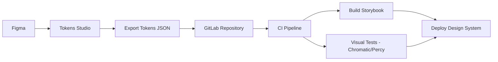
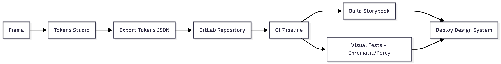
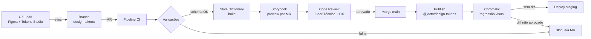
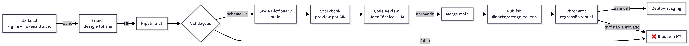
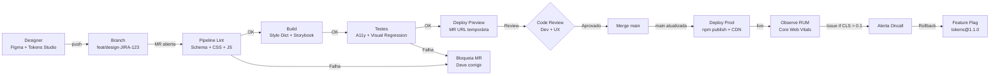
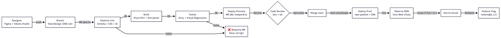

# Plano de DesignOps — Jacto Drones Operating System 

## Sumário

1. [Introdução, Objetivo e Filosofia DesignOps](#1-introdução-objetivo-e-filosofia-designops)
2. [Como Trabalhamos Juntos — Pessoas, Papéis e Rituais](#2-como-trabalhamos-juntos--pessoas-papéis-e-rituais)
3. [Como o Trabalho é Feito (Processos e Ferramentas)](#3-como-o-trabalho-é-feito-processos-e-ferramentas)
4. [Design System, Tokens e Fluxo Design-to-Code](#4-design-system-tokens-e-fluxo-design-to-code)
5. [Integração com Esteira CI/CD](#5-integração-com-esteira-cicd)
6. [Mensuração de Impacto (REACH + DoD)](#6-mensuração-de-impacto-reach--dod)
7. [Governança, Riscos e Evolução do DesignOps](#7-governança-riscos-e-evolução-do-designops)

---

## 1. Introdução, Objetivo e Filosofia DesignOps

### Contexto e objetivo
No contexto da construção do nosso módulo de CI/CD para o parceira do projeto (Jacto Drones), a entrega contínua de valor exige que a interface e a experiência do usuário (UX) fluam sem atritos pela nossa esteira de automação. O objetivo desta seção é fundamentar a arquitetura da nossa infraestrutura operacional, adotando a premissa fundamental de que a prática de DesignOps deve ser encarada e operada como o "DevOps do Design".

### 1.1 A Filosofia: DesignOps como o DevOps do Design
Historicamente, o DevOps emergiu (com destaque a partir da palestra de Patrick Debois na Agile 2008) para solucionar gargalos de eficiência e conflitos operacionais entre as áreas de desenvolvimento e operações de TI. Trata-se de uma abordagem cultural e técnica que melhora a colaboração, automação e produtividade rumo à integração e entrega contínuas. 

De maneira análoga, o DesignOps é a prática de otimizar processos, infraestrutura e ferramentas que dão suporte ao trabalho de design [2]. Sua filosofia baseia-se na orquestração e otimização de pessoas e fluxos de trabalho para amplificar o impacto e o valor do design em escala. No fluxo de entrega contínua, o DesignOps atua para que as definições de componentes e protótipos sejam validadas e transpostas para código de maneira tão automatizada quanto as próprias builds de software, endereçando o "caos ferramental" que Malouf (2017) aponta como gargalo operacional do design [2].

### 1.2 Os Três Pilares Operacionais
Para estruturar as operações em nosso time, baseamos nossa governança nos três pilares estabelecidos pelo Nielsen Norman Group (NN/g):
* **Como trabalhamos juntos (*How we work together*):** Foco em Organizar (estrutura e papéis), Colaborar (rituais e ambientes) e Humanizar (desenvolvimento e embarque).
* **Como realizamos o trabalho (*How we get work done*):** Esforço para Padronizar processos, Harmonizar o sistema (Design System) e Priorizar o fluxo de trabalho de forma equilibrada.
* **Como nosso trabalho cria impacto (*How our work creates impact*):** Estratégias para Medir o desempenho, Socializar o sucesso (recompensas) e Possibilitar o avanço técnico (guias e treinamentos).

### 1.3 Paralelo: DevOps ↔ DesignOps
Para que a esteira CI/CD seja bem-sucedida, estabelecemos o seguinte pareamento funcional entre engenharia e design no projeto:

| Dimensão | DevOps | DesignOps |
| :--- | :--- | :--- |
| **Automação e Ferramentas** | Utiliza ferramentas de CI/CD para automatizar a construção, teste e implantação do software de forma sistêmica. | Implementa sistemas para automatizar fluxos de trabalho de design, gestão de ativos e prototipagem (ex: Design Tokens pipeline). |
| **Integração e Colaboração** | Promove integração contínua facilitando a resolução de problemas de infraestrutura rapidamente. | Enfatiza a integração entre designers e desenvolvedores para que as decisões de design sejam implementadas com fidelidade. |
| **Ciclos de Feedback Rápido** | Feedback veloz devido à integração e testes automatizados (Test, Build, Deploy). | Avaliação rápida por meio de revisões sistemáticas, testes de usuários e iterações constantes de usabilidade. |
| **Qualidade e Consistência** | Foco em entregar software escalável através de monitoramento. | Foco em assegurar consistência usando guias de estilo, bibliotecas de componentes e auditorias de UI. |

Ambas as abordagens visam a quebra de silos, a colaboração multidisciplinar, a eficiência operacional e a entrega contínua de valor de ponta a ponta.

### Decisões de trade-off
* **Cultura Estrutural vs. Adoção Puramente Ferramental:** No planejamento do nosso modelo de DesignOps, consideramos inicialmente a adoção exclusiva de ferramentas de versionamento visual. Descartamos essa via técnica isolada pois a história inicial do DevOps demonstrou que focar unicamente em agilidade de infraestrutura oferece uma "visão parcial" que não resolve conflitos reais entre equipes. Optamos por um *rollout* híbrido, onde a mudança de processos e rituais antecede a configuração dos *pipelines* técnicos.
* **Padronização Total vs. Autonomia:** Consideramos aplicar políticas rígidas para todos os componentes criados. Como *trade-off*, relaxamos essa regra na fase de ideação (Discovery) para não reduzir a velocidade criativa. O rigor da padronização (linting, revisão) só ocorre ao tentar inserir componentes na biblioteca global (Delivery).

### Referências da Seção 1

- [1] Kaplan, K. (2019). *DesignOps 101*. Nielsen Norman Group. https://www.nngroup.com/articles/design-operations-101/
- [2] Malouf, D. (2017). *What is design operations and why should you care?*. Designer Hangout. https://medium.com/designer-hangout/what-is-design-operations-and-why-should-you-care-b72f02b47761
- [3] Atlassian. *O que é DevOps?*. https://www.atlassian.com/br/devops
- [4] Gaea. *Conheça a incrível história do DevOps*. https://gaea.com.br/conheca-a-incrivel-historia-do-devops/

**Responsável:** Davi Versan

---

## 2. Como Trabalhamos Juntos — Pessoas, Papéis e Rituais

### Contexto e objetivo

O Jacto Drones Operating System v0.1 é desenvolvido por sete estudantes em sprints semanais, com firmware embarcado, plataforma de serviços e plataforma de dados/BI convergindo num dashboard operacional de métricas DORA (RNF002). Nessa escala, o gargalo do DesignOps está na coordenação entre duplas da Sprint 1 e na interlocução com Thamires (Ponto Focal Jacto), não na ferramenta. A seção aplica Organize, Collaborate e Humanize de Kaplan (2019) [1] à organização do time.

### 2.1 Estrutura do time (componente Organize)

A estrutura do time reflete a divisão real da Sprint 1 (Duplas A, B, C e Coringa), sem inventar papéis dedicados que sete pessoas não sustentam.

| Papel funcional | Integrante | Responsabilidade no DesignOps | Artefato/área de propriedade |
|---|---|---|---|
| UX Lead — Pesquisa e Jornadas | Yasmin Minario | Mapear jornadas dos engenheiros usuários (firmware, controle, BI) e validar fluxos do dashboard | Personas, mapa de jornadas, mapa de interlocutores internos Jacto |
| UX Lead — Interface e Design System | Ryan Gartlan | Curadoria de componentes, fidelidade visual nas telas do OS v0.1 | Biblioteca Figma, especificação de telas |
| Dev Lead — tokens (acúmulo) | Ryan Gartlan | Definir contratos de naming W3C e versionamento de tokens via Tokens Studio | **tokens.json**, configuração Tokens Studio, Style Dictionary |
| DevOps Engineer — pipeline visual | Larissa Temoteo | Esteira CI/CD, gates de regressão visual e acessibilidade, registry de artefatos | **.gitlab-ci.yml**, ambiente de preview, baseline Chromatic |
| Frontend Developer | Rodrigo Lee | Implementar dashboard React + TypeScript + Tailwind consumindo tokens publicados | Componentes do dashboard operacional, telas de configuração de esteira |
| Backend Developer | Davi Versa, Rafael Barbosa | APIs de manifesto de release (RNF003) e Problem Reports consumidas pelas telas | Endpoints e contratos consumidos pelo dashboard |
| QA — regressão visual | Tainá Cortez | Revisão cruzada entre frentes, baseline visual e ata de critique | Relatórios de regressão, ata de Design Critique |
| Product Owner / Scrum Master | [A DEFINIR — rotativo por sprint] | Priorização do backlog, facilitação das cerimônias | Backlog GitLab, agenda da sprint |
| Ponto Focal Externo (stakeholder externo Jacto) | Thamires Silva (backup: Camille Amaral) | Aderência ao negócio, interlocução com líderes técnicos Vinícius e Roosevelt | Validação de telas-chave, sign-off de release |

A dupla UX (Yasmin + Ryan) é mantida porque pesquisa de jornadas e construção de design system têm cadências distintas — a primeira nas Sprints 2–3, a segunda nas 4–5. Larissa permanece em DevOps por continuidade da Dupla B (Esteira) da Sprint 1, evitando re-onboarding no pipeline **.gitlab-ci.yml**. Ryan acumula tokens com UX de interface porque a fronteira entre componente Figma e token W3C é estreita demais para dois ownerships. Considerou-se um Design Producer dedicado [1, 2], descartado porque sete integrantes em sprint semanal são coerentes com DesignOps como Mentalidade, não como função especializada.

### 2.2 Matriz RACI para decisões de design

A matriz RACI [3] explicita quem decide o quê em cada artefato que cruza a fronteira design–código.

| Decisão | UX Lead | Dev Lead | DevOps | PO/Scrum | Ponto Focal Jacto |
|---|---|---|---|---|---|
| Criação de protótipo de tela (dashboard, Problem Report) | R, A | C | I | C | I |
| Aprovação visual antes do merge | R | A | I | C | C |
| Publicação de novos tokens no registry | C | R, A | C | I | I |
| Deploy do dashboard em staging | I | C | R, A | C | I |
| Mudança breaking no design system | C | C | C | R, A | C |
| Aderência do dashboard ao negócio Jacto | C | I | I | R | A |

Legenda: R = Responsible, A = Accountable, C = Consulted, I = Informed.

Dois pontos não são óbvios. UX é Consulted em tokens mas Accountable em UI porque tokens são contrato técnico (naming W3C, build via Style Dictionary), enquanto a UI é o entregável visível ao engenheiro Jacto que opera o dashboard. Thamires é Accountable na aderência ao negócio porque representa a decisão final sobre valor operacional para pulverização agrícola — julgamento que nem o time, nem a Profª Julia podem substituir.

### 2.3 Rituais e cadências (componente Collaborate)

Os rituais formalizam o que a Sprint 1 já praticava: daily, sync pós-almoço e revisão cruzada entre duplas.

| Ritual | Objetivo | Frequência | Participantes | Output |
|---|---|---|---|---|
| Daily Stand-up | Sincronizar bloqueios e progresso entre as três frentes | Diária, 15 min | Os 7 integrantes | Atualização das colunas no quadro GitLab |
| Design Sync | Alinhar decisões visuais entre duplas (herdado do sync pós-almoço da Sprint 1) | Diária, 20 min após o almoço | Yasmin, Ryan, Rodrigo, Larissa | Comentário de decisão na issue correspondente |
| Handover Design→Dev | Transferir tela validada para implementação | A cada nova tela do dashboard | UX Lead + Frontend Dev + DevOps | Issue com critérios de aceite e link Figma |
| Design Critique | Revisão coletiva de fidelidade e UX | Quinzenal, 45 min | Time + Thamires (Jacto) quando agendado; Vinícius e Roosevelt em releases-chave | Ata curta no GitLab + ações no backlog |
| Retrospectiva de DesignOps | Avaliar atritos entre design, dev e esteira | Fim de sprint, 30 min | Os 7 integrantes | Ações verificáveis para a próxima sprint |

O Critique é quinzenal, não semanal, porque uma sprint de sete dias não acumula volume de decisões visuais que justifique crítica coletiva semanal — concentrá-las a cada duas sprints permite que Thamires e os líderes Vinícius e Roosevelt revisem um conjunto coerente de telas. A Daily e o Design Sync mantêm a cadência já validada na Sprint 1, ancorada nas recomendações do Scrum Guide [4] sobre eventos timeboxados curtos.

### 2.4 Canais de comunicação

Cada canal tem propósito definido para evitar que decisão importante se perca no fluxo síncrono do WhatsApp.

- **WhatsApp (canal principal):** alinhamentos rápidos, dúvidas síncronas, bloqueios urgentes e coordenação de presença em sync. Não é fonte de verdade — qualquer decisão que sair daqui precisa virar issue ou comentário no GitLab.
- **Issues e Merge Requests no GitLab:** decisões persistidas, justificativas arquiteturais, registro auditável de aprovações. É a fonte de verdade do projeto, ancorada em labels (**design-token**, **regressao-visual**, **handover**) que tornam buscas previsíveis.
- **Comentários no Figma:** discussões sobre fidelidade visual, comportamento de componente e variantes, ancoradas ao próprio artefato — útil para que Yasmin e Ryan resolvam dúvidas locais sem fragmentar conversas em outro canal.
- **Sync síncrono (presencial ou videochamada):** decisões com trade-off complexo, conflito entre duplas e validação com a Jacto envolvendo Thamires, Vinícius ou Roosevelt. Toda sync gera ata curta no GitLab, com decisão e responsável.

A regra: decisão importante não tomada por escrito é decisão não tomada. Toda escolha de impacto arquitetural ou visual termina em Architecture Decision Record (ADR) no GitLab [5].

### 2.5 Humanize — onboarding e circulação de conhecimento

O componente Humanize [1] é onde times pequenos falham primeiro: conhecimento crítico se concentra em uma única pessoa e o pipeline trava quando essa pessoa fica indisponível. Esta subseção endereça onboarding, distribuição de conhecimento e comunidade de prática.

**1. Onboarding de novo integrante (duas primeiras semanas).**

- [ ] Acesso a GitLab, Figma, registry de tokens, ambiente de preview e grupo de WhatsApp concedidos na primeira sessão.
- [ ] Leitura obrigatória do **DESIGN_OPS.md**, do **README** do repositório e das três últimas issues fechadas das Duplas A, B e C, para entender o estado atual da Esteira, da Arquitetura ISO 10746 e dos Requisitos SCM.
- [ ] Sessão pareada com um integrante da dupla de destino em uma daily completa e em um sync pós-almoço antes de assumir issue própria.
- [ ] Walkthrough guiado do **.gitlab-ci.yml** com Larissa, cobrindo gates de acessibilidade, registry de tokens e ambiente de Storybook.
- [ ] Primeira contribuição supervisionada: micro-tarefa em token ou story de Storybook, com revisão obrigatória de Ryan e de mais um par da dupla destino.
- [ ] Apresentação relâmpago na comunidade de prática até o fim da segunda semana, fixando o que foi aprendido.

**2. Distribuição de conhecimento de design entre devs.**

O risco maior é Ryan virar single point of failure por acumular UX de interface e ownership de tokens. Três mecanismos mitigam: (a) pair programming obrigatório em mudanças de UI que toquem dashboard, telas de esteira ou diagnósticos de Problem Report, com Ryan pareando com Rodrigo e Yasmin; (b) code review com dois aprovadores em toda MR que altere **tokens/** ou **components/**, com Larissa cobrindo pipeline e Tainá regressão visual; (c) Architecture Decision Records [5] para naming de token, convertendo memória individual em artefato versionado.

**3. Comunidade de prática interna.**

A comunidade segue formato relâmpago semanal de 20 minutos: um integrante apresenta um aprendizado de UX, frontend ou DesignOps aos outros seis. Em time de sete, cada pessoa apresenta a cada sete a oito semanas — recorrência suficiente sem competir com o backlog. O formato curto e regular segue Wenger (1998) [6] sobre comunidade de prática como aprendizado situado e contínuo.

### Decisões de trade-off

Adotou-se DesignOps como Mentalidade em vez de Design Producer dedicado porque sete integrantes em sprints semanais não sustentam função especializada [1, 2]. Adotou-se Critique quinzenal em vez de semanal porque a sprint de sete dias não comporta crítica coletiva com volume útil [4]. Adotou-se acúmulo de Ryan (UX + tokens) com pair programming e duplo aprovador em vez de funções separadas porque a fronteira entre Figma e token W3C é estreita demais para dois ownerships paralelos.

### Referências da Seção 2

[1] Kaplan, K. (2019). *DesignOps 101*. Nielsen Norman Group. https://www.nngroup.com/articles/design-operations-101/

[2] Malouf, D. (2017). *What is Design Operations and why should you care?*. Designer Hangout. https://medium.com/designer-hangout/what-is-design-operations-and-why-should-you-care-b72f02b47761

[3] Project Management Institute (2021). *A Guide to the Project Management Body of Knowledge (PMBOK Guide)*, 7ª ed. PMI. https://www.pmi.org/pmbok-guide-standards

[4] Schwaber, K., & Sutherland, J. (2020). *The Scrum Guide*. https://scrumguides.org/scrum-guide.html

[5] Atlassian. *Architecture Decision Records*. https://www.atlassian.com/blog/software-teams/architecture-decision-records

[6] Wenger, E. (1998). *Communities of Practice: Learning, Meaning, and Identity*. Cambridge University Press.

**Responsável:** Larissa Temoteo

---

## 3. Como o Trabalho é Feito (Processos e Ferramentas)

### Contexto e objetivo

A presente seção define a stack de ferramentas como um **sistema integrado de DesignOps**, alinhado ao princípio de *Standardize* da Nielsen Norman Group, no qual ferramentas não são adotadas isoladamente, mas como uma infraestrutura contínua que conecta decisões de design à entrega automatizada via CI/CD. O objetivo é eliminar a fragmentação observada no projeto (Sprint 1) e estabelecer uma **fonte única de verdade**, garantindo rastreabilidade, consistência visual e automação ponta a ponta.


### 3.1 Stack integrada e justificativa

A stack adotada é composta por:

* **Figma + Tokens Studio**
  Resolve a criação colaborativa de interfaces e a extração estruturada de *design tokens*. O uso do Tokens Studio permite transformar decisões visuais em artefatos versionáveis (JSON), conectando design ao código.
  *Alternativa considerada:* Adobe XD + export manual de variáveis.
  *Motivo da rejeição:* ausência de integração nativa com pipelines automatizados e menor maturidade no ecossistema de tokens.

* **GitLab**
  Atua como repositório central e orquestrador da esteira CI/CD, consolidando código, tokens e documentação.
  *Alternativa:* GitHub Actions.
  *Motivo da rejeição:* menor integração nativa com pipelines corporativos e controle centralizado de CI em comparação ao GitLab no contexto do projeto.

* **Storybook**
  Funciona como repositório vivo de componentes, garantindo alinhamento entre design e implementação.
  *Alternativa:* documentação estática (Wiki).
  *Motivo da rejeição:* não garante validação interativa nem isolamento de componentes.

* **Chromatic (ou Percy)**
  Responsável por testes de regressão visual automatizados.
  *Alternativa:* testes manuais.
  *Motivo da rejeição:* inviável em escala e sujeito a erro humano.

* **Linters de CSS (Stylelint)**
  Garantem padronização e conformidade automática com tokens e guidelines.
  *Alternativa:* revisão manual.
  *Motivo da rejeição:* baixa confiabilidade e alto custo operacional.

Essa composição responde diretamente à crítica de **Malouf (2017)** sobre o “caos ferramental” em design, mitigando silos ao integrar design, código e validação em um fluxo único.


### 3.2 Arquitetura do fluxo (Design-to-CI/CD)





O fluxo evidencia a transformação de artefatos de design em código executável e validado automaticamente, alinhando-se ao conceito de DesignOps como “DevOps do Design”.


### 3.3 Convenções de padronização

Para garantir consistência e rastreabilidade:

* **Componentes:** **ds-button-primary**, **ds-card-user**
* **Branches:** **design/feature-nome**, **tokens/update-colors**
* **Commits (Conventional Commits):**

  * **feat(ui): adiciona componente botão**
  * **fix(tokens): corrige escala de cores**
  * **chore(storybook): atualiza documentação**

Essas convenções suportam automação e leitura por pipelines, alinhando-se às práticas de SCM e CI/CD.


### 3.4 Auditoria e controle de "shadow tooling"

Para evitar o surgimento de ferramentas paralelas não governadas:

* Toda ferramenta deve estar registrada no repositório (README ou Wiki)
* Integração obrigatória com GitLab (direta ou via API)
* Revisão trimestral de uso (ferramentas sem uso são descontinuadas)
* Bloqueio de artefatos externos não versionados no pipeline

Esse controle garante aderência à ISO/IEC 25010 no aspecto de **manutenibilidade e rastreabilidade**, evitando perda de consistência operacional.


### Decisões de trade-off

* **Centralização vs Flexibilidade:** optou-se por centralização no GitLab, sacrificando flexibilidade individual em favor de consistência sistêmica.
* **Automação vs Simplicidade:** adoção de regressão visual automatizada aumenta complexidade inicial, mas reduz drasticamente erros em produção.
* **Ferramentas especializadas vs generalistas:** priorizou-se ferramentas especializadas (Tokens Studio, Chromatic) para garantir qualidade técnica.

### Referências da Seção 3

- [1] Nielsen Norman Group (2020). *Design Operations 101*. https://www.nngroup.com/articles/design-operations-101/
- [2] Malouf, P. (2017). *What is Design Operations and Why Should You Care?*. Designer Hangout. https://medium.com/designer-hangout/what-is-design-operations-and-why-should-you-care-b72f02b47761
- [3] Figma. *Documentation*. https://help.figma.com/
- [4] Storybook. *Documentation*. https://storybook.js.org/docs
- [5] GitLab. *CI/CD Documentation*. https://docs.gitlab.com/ee/ci/
- [6] Conventional Commits. *A specification for adding human and machine readable meaning to commit messages*. https://www.conventionalcommits.org/

**Responsável:** Rodrigo Lee

---

## 4. Design System, Tokens e Fluxo Design-to-Code

### Contexto e objetivo

O nosso entregável para a Jacto Drones é o **Operating System v0.1 de Continuous Delivery** — um meta-produto de engenharia que organiza, automatiza e mede o desenvolvimento de software ao longo das três frentes da Jacto Drones: firmware embarcado (Frente 1), plataforma de serviços ao cliente (Frente 2) e plataforma de gestão e BI (Frente 3). A camada visual do OS é o **dashboard operacional** que expõe cycle time, throughput, estado do backlog e gargalos de fluxo a líderes técnicos e ao ponto focal do projeto. Numa ferramenta cujo propósito é dar visibilidade sobre o próprio processo de engenharia, **inconsistência visual mina a confiança nos dados**: se o mesmo "verde" significa coisas diferentes em telas distintas, o dashboard deixa de ser sinal e vira ruído. Esse atrito é exatamente o gargalo que Malouf (2017) descreve quando aponta que "design tools don't offer the marketplace the same level of scale" que ferramentas de desenvolvimento já oferecem [1].

A nossa resposta é tratar o design system como **código versionado**: Design Tokens funcionam como contrato formal entre design e implementação, e um pipeline determinístico traduz mudanças visuais em build sem intervenção manual — em coerência com o objetivo central do próprio OS, que é eliminar atividades repetitivas e padronizar critérios de qualidade. Esta seção descreve a arquitetura de tokens em três camadas, o pipeline Design-to-Code passo a passo (etapas humanas vs. automatizadas), o versionamento SemVer aplicado a tokens e componentes, a política de breaking changes com período de deprecation e a matriz de priorização que protege o time de "construir tudo do zero".

### 4.1 Arquitetura de Design Tokens em três camadas

Adotamos a arquitetura em três níveis recomendada pelo Design Tokens Community Group do W3C [2] e popularizada pelo Style Dictionary, da Amazon [3]:

| Camada | O que armazena | Exemplo no Jacto Drones OS | Quem altera |
|---|---|---|---|
| **Global tokens** | Valores brutos, sem semântica de uso. | **color-green-500: #16A34A**, **space-200: 8px**, **font-size-300: 16px** | UX Lead, raramente. |
| **Alias tokens** | Intenção semântica que aponta para um global. | **color-status-success: {color-green-500}** (build verde), **color-frente-firmware: {color-purple-500}** | UX Lead, com revisão. |
| **Component tokens** | Tokens específicos de componente, apontando para um alias. | **kpi-card-success-bg: {color-status-success}**, **pipeline-badge-success-text: {color-status-success}** | UX Lead + Líder Técnico, em conjunto. |

A vantagem desta separação é operacional: alterar a cor de "build com sucesso" em todos os widgets do dashboard exige mudar **um único alias token**, e todos os componentes consumidores (KPI cards de cycle time, badges de status de pipeline, ícones de estado no backlog) herdam a mudança automaticamente no próximo build. É o equivalente, no design, ao princípio DRY (Don't Repeat Yourself) que rege engenharia de software — uma única fonte da verdade, propagada por composição.

**Decisão de trade-off:** consideramos uma estrutura plana de dois níveis (global → component) por simplicidade, mas descartamos porque acopla decisões visuais a componentes específicos — um anti-padrão que torna rebrand e tematização (claro/escuro, alto contraste) exponencialmente caros. A camada de alias é o que permite, por exemplo, atribuir uma cor consistente a cada uma das três frentes (firmware, serviços, BI) em qualquer visualização do dashboard, sem duplicar regras em cada componente.

### 4.2 Pipeline Design-to-Code, etapa por etapa

O fluxo abaixo é executado a cada mudança em token ou componente. Cada etapa é marcada como **[manual]** quando exige ação humana e **[automatizado]** quando roda no pipeline sem intervenção.

1. **[manual] Edição no Figma.** O UX Lead altera o token usando o plugin Tokens Studio for Figma [4], que persiste os valores em formato JSON dentro do próprio arquivo de design.
2. **[automatizado] Sync para repositório Git.** O plugin sincroniza as mudanças com a branch **design-tokens** do repositório **jacto-design-system/** no GitLab via integração nativa.
3. **[automatizado] Abertura de Merge Request.** Um webhook do GitLab cria um MR com o diff dos tokens em formato JSON legível, anexando o baseline anterior para revisão.
4. **[automatizado] Pipeline de validação.** Roda em sequência:
   - Validação de schema (estrutura JSON conforme a spec do W3C [2]).
   - Build com Style Dictionary [3], que gera artefatos em CSS Custom Properties, JS (ES Modules) e JSON (consumível também por superfícies não-web — caso o OS evolua para um CLI ou plugin de IDE com identidade visual coerente).
   - Geração de preview no Storybook em URL temporária por MR (deploy de review).
5. **[manual] Code review duplo.** Líder Técnico aprova consistência técnica (nomenclatura, ausência de tokens órfãos); UX Lead aprova fidelidade visual no preview.
6. **[automatizado] Merge na main.** Dispara rebuild dos componentes consumidores e publica nova versão do pacote **@jacto/design-tokens** no registry interno do GitLab.
7. **[automatizado] Testes de regressão visual.** Chromatic compara screenshots dos componentes contra o baseline aprovado; qualquer diff não-aprovado bloqueia o deploy (detalhamento na Seção 5).
8. **[automatizado] Deploy em staging.** A aplicação do dashboard rebuilds automaticamente e sobe em ambiente de homologação para validação antes do release manual em produção.





### 4.3 Versionamento e política de breaking changes

Aplicamos Semantic Versioning (SemVer) ao pacote de tokens e ao pacote de componentes, com regras explícitas que servem de contrato com os consumidores do dashboard do OS — e, futuramente, com qualquer outra superfície (CLI, plugins de IDE) que precise reaproveitar a identidade visual:

- **PATCH** (**1.0.x**): correções visuais que não alteram contrato — ajuste de 1px num espaçamento, fix de cor em estado hover, correção de typo em label.
- **MINOR** (**1.x.0**): novos tokens, novos componentes ou novas variantes de componentes existentes — adições retrocompatíveis (consumidor pode atualizar sem mexer em código).
- **MAJOR** (**x.0.0**): renomeação ou remoção de tokens, mudança de assinatura de prop em componente, qualquer alteração que exija refactor no consumidor.

**Política de breaking changes** em três passos:

1. **Aviso prévio.** Toda mudança breaking abre uma issue no GitLab com a label **breaking-change** e prazo mínimo de uma sprint antes do release. A issue precisa listar os componentes/telas impactados.
2. **Período de deprecation.** O token ou componente antigo continua funcional por uma versão MAJOR completa, emitindo **console.warn** em desenvolvimento (e **@deprecated** JSDoc para integração com TypeScript). Isso dá ao time consumidor uma janela explícita para migrar.
3. **Changelog explícito.** Seguindo o padrão Keep a Changelog [5], cada release documenta **Added**, **Changed**, **Deprecated**, **Removed**, **Fixed**, **Security**. O CI exige que o **CHANGELOG.md** tenha sido atualizado para que o MR seja aprovado.

Esta política é coerente com um dos objetivos centrais do OS, segundo a TAPI da Jacto Drones: **estabelecer critérios padronizados de qualidade e Definition of Done**. Versionar tokens com a mesma rigidez com que versionamos código de aplicação reforça que mudanças visuais são mudanças de produto — e, como tal, precisam ser rastreáveis e reversíveis.

### 4.4 Matriz de priorização — o que entra primeiro no design system

Um erro recorrente em design systems acadêmicos é tentar componentizar tudo desde o início, gerando overhead que o time não consegue sustentar até o final do semestre. Para evitar isso, priorizamos componentes pela matriz frequência × custo, derivada do componente **Prioritize** do framework da NN/g [6]:

|   | **Baixo custo de implementação** | **Alto custo de implementação** |
|---|---|---|
| **Alta frequência de uso** | **Prioridade 1 — Fazer primeiro** (Button, Input, KPICard, StatusBadge) | **Prioridade 2 — Fazer segundo** (Modal, BacklogTable, MetricChart, FilterPanel) |
| **Baixa frequência de uso** | **Prioridade 3 — Fazer se sobrar tempo** (Tag, Tooltip, Breadcrumb) | **Não fazer** (componentes hiper-específicos de uma única tela) |

A NN/g recomenda "uncovering and exposing bottlenecks in the design workflow" antes de adicionar complexidade ao sistema [6]. No nosso caso, os componentes da Prioridade 1 são justamente os que aparecem em **todas** as telas do dashboard de desenvolvimento — **KPICard** exibindo cycle time, **StatusBadge** marcando saúde do build, **Button** como ação primária. Investir nesses componentes primeiro maximiza o retorno por hora de design system e protege o time de gastar capacidade em elementos que serão usados duas vezes.

### Decisões de trade-off

* **Tokens Studio + Git vs. exportação manual:** consideramos exportação manual de tokens via "Inspect" do Figma, mas descartamos porque introduz drift entre design e código. O sync via Tokens Studio garante que o JSON versionado no Git é a única fonte da verdade — alinhado ao objetivo do próprio OS de eliminar atividades manuais repetitivas.
* **Style Dictionary vs. soluções proprietárias (Theo, Diez):** avaliamos Theo (Salesforce) e Diez, mas optamos pelo Style Dictionary por ter comunidade ativa, suportar múltiplos formatos de output e ser stack-agnóstico — útil porque o OS pode evoluir para superfícies não-web (CLI, plugin de IDE) que ainda assim precisam respeitar a identidade visual.
* **Component tokens granulares vs. apenas alias:** avaliamos parar a hierarquia na camada de alias para reduzir indireção, mas mantivemos a terceira camada porque permite que componentes críticos do dashboard (**KPICard**, **StatusBadge**, **AlertBanner**) tenham contratos visuais explícitos, facilitando auditoria de acessibilidade e rastreabilidade de mudanças.
* **Versionamento único vs. independente entre tokens e componentes:** consideramos um único pacote monolítico, mas separamos **@jacto/design-tokens** e **@jacto/design-system** (componentes) para que aplicações leves (e.g., um futuro CLI do OS com saída TUI estilizada) possam consumir tokens "puros" sem arrastar a biblioteca de componentes inteira — reduz a superfície de breaking change.

### Referências da Seção 4

- [1] Malouf, D. (2017). *What is design operations and why should you care?*. Designer Hangout. https://medium.com/designer-hangout/what-is-design-operations-and-why-should-you-care-b72f02b47761
- [2] Design Tokens Community Group (W3C). *Design Tokens Format Module*. https://tr.designtokens.org/format/
- [3] Amazon. *Style Dictionary — A build system for creating cross-platform styles*. https://amzn.github.io/style-dictionary/
- [4] Tokens Studio. *Tokens Studio for Figma — Documentation*. https://docs.tokens.studio/
- [5] Keep a Changelog. https://keepachangelog.com/
- [6] Kaplan, K. (2019). *DesignOps 101*. Nielsen Norman Group. https://www.nngroup.com/articles/design-operations-101/

**Responsável:** Ryan Gartlan

---

## 5. Integração com Esteira CI/CD

### Contexto e objetivo

No projeto da Jacto Drones, os artefatos de design system (componentes UI, Design Tokens, estilos globais) devem fluir pela mesma esteira de automação que o firmware e a telemetria. Hoje, a plataforma de serviços (Frente 2) e a plataforma de BI (Frente 3) dependem de mudanças visuais que precisam chegar a produção sem regressão, sem inconsistência de marca e sem quebra de acessibilidade. Sem um pipeline determinístico que valide, testa e promova artefatos de UI, o risco é alto: retrabalho, inconsistência visual e aderência reduzida às normas WCAG que operações críticas (como dashboards de campo) exigem.

Esta seção detalha como o DesignOps se integra ao pipeline CI/CD através de estágios de linting, build, testes automatizados (acessibilidade e regressão visual), gates de qualidade e observabilidade em produção. O objetivo operacional é que **toda mudança de design ou token que chegue a main tenha passado por validação automatizada**, e que saibamos em tempo real se ela impactou a experiência do usuário final. O desenho descrito é o **estado-alvo** do pipeline para o OS v0.1: alguns gates já estão em rascunho (lint de schema, build do Storybook), outros serão implementados ao longo das próximas sprints (regressão visual e RUM em produção).

### 5.1 Arquitetura do Pipeline: Estágios e Pseudo-Configuração

O pipeline adota a estrutura GitLab CI/CD com cinco estágios principais. Cada um gatilha-se automaticamente ao push em branches de feature ou ao abrir Merge Request:

```yaml
# .gitlab-ci.yml — Design System Pipeline
# Executado a cada mudança em src/design-tokens/, src/components/ ou docs/

stages:
  - lint
  - build
  - test
  - deploy-preview
  - deploy
  - observe

variables:
  DESIGN_SYSTEM_VERSION: "1.0"
  REGISTRY_URL: "https://registry.gitlab.com/jacto/design-system"

# ============ ESTÁGIO LINT ============
lint:schema:
  stage: lint
  image: node:18-alpine
  script:
    - npm install
    - npm run validate:tokens
      # Valida schema JSON contra W3C Design Tokens Spec
    - npm run lint:css
      # Stylelint para WCAG AA contrast ratio
    - npm run lint:js
      # ESLint + @testing-library/react
  artifacts:
    reports:
      sast: gl-sast-report.json
  allow_failure: false

# ============ ESTÁGIO BUILD ============
build:design-system:
  stage: build
  image: node:18-alpine
  dependencies:
    - lint:schema
  script:
    - npm run build:tokens
      # Style Dictionary: global → alias → component tokens
    - npm run build:storybook
      # Compila componentes em .storybook/static
    - npm run build:package
      # Gera @jacto/design-tokens@next no registry
  artifacts:
    paths:
      - dist/
      - .storybook/static/
    expire_in: 7 days
  only:
    - merge_requests
    - main

# ============ ESTÁGIO TEST ============
test:accessibility:
  stage: test
  image: node:18-alpine
  dependencies:
    - build:design-system
  script:
    - npm run test:a11y
      # axe-core + Pa11y via Storybook snapshot testing
      # Valida todos os componentes contra WCAG 2.1 AA
  artifacts:
    reports:
      accessibility: a11y-report.json
  allow_failure: false

test:visual-regression:
  stage: test
  image: node:18-alpine
  dependencies:
    - build:design-system
  script:
    - npm run test:visual
      # Chromatic: compara screenshots pixel-perfect vs baseline
      # Bloqueia se houver diff não-aprovado
  artifacts:
    reports:
      dotenv: chromatic.env
  allow_failure: false

# ============ ESTÁGIO DEPLOY PREVIEW ============
deploy:preview:
  stage: deploy-preview
  image: node:18-alpine
  dependencies:
    - build:design-system
  script:
    - npm run deploy:storybook-preview
      # Deploy Storybook em URL temporária: https://mr-${CI_MERGE_REQUEST_IID}.preview.design.jacto.dev
  environment:
    name: preview/$CI_MERGE_REQUEST_IID
    url: https://mr-${CI_MERGE_REQUEST_IID}.preview.design.jacto.dev
    auto_stop_in: 7 days
  only:
    - merge_requests

# ============ ESTÁGIO DEPLOY ============
deploy:production:
  stage: deploy
  image: node:18-alpine
  dependencies:
    - test:accessibility
    - test:visual-regression
  script:
    - npm run publish:npm
      # Publica @jacto/design-tokens@${VERSION} no registry privado
    - npm run deploy:cdn
      # CSS Custom Properties compiladas no CDN (Cloudflare)
  environment:
    name: production
    url: https://design.jacto.dev
  only:
    - main
  when: manual

# ============ ESTÁGIO OBSERVE ============
observe:rum:
  stage: observe
  image: curlimages/curl:latest
  script:
    - curl -X POST https://rum.jacto.dev/ingest
      -H "Content-Type: application/json"
      -d '{
        "version": "'${CI_COMMIT_TAG}'",
        "timestamp": "'$(date -u +%Y-%m-%dT%H:%M:%SZ)'",
        "metrics": { "lcp": true, "cls": true, "fid": true }
      }'
      # Inicia coleta de RUM para este release
  only:
    - tags
```

### 5.2 Quality Gates: Travas de Segurança que Bloqueiam Merge

Um DesignOps maduro não é apenas "rápido" — é **confiável**. Por isso, implementamos travas automáticas que impedem merge se qualquer gate falhar:

| Gate | Critério | Responsabilidade | Ação se Falhar |
|---|---|---|---|
| **Schema Tokens** | Estrutura JSON conforme W3C spec | **lint:schema** | Bloqueia MR |
| **WCAG AA Contrast** | Razão de contraste ≥ 4.5:1 (texto); ≥ 3:1 (gráficos) | **test:accessibility** | Bloqueia MR |
| **Regressão Visual** | Zero diffs não-aprovados em Chromatic | **test:visual-regression** | Bloqueia MR |
| **Token Contrato** | Nomes de tokens quebrados não aparecem em imports | **lint:schema** | Bloqueia MR |
| **Performance CSS** | Bundle de CSS < 50KB gzipped | **build:design-system** | Aviso (não bloqueia) |
| **Documentação** | Componentes novos têm stories + docstring | Code Review Manual | Bloqueia MR |

A razão de ser dura: uma cor com contraste insuficiente em um dashboard de operação de drone pode causar leitura errada de status crítico em campo. A Jacto não pode ter "quase acessível".

### 5.3 Estratégia de Rollback Visual

Deploy em produção é irreversível em tempo real, mas DesignOps precisa de um plano B. Adotamos:

1. **Imutabilidade de Releases:** Cada versão published (**@jacto/design-tokens@1.2.0**) é imutável no registry. Nunca sobrescrevemos.
2. **Rollback Automático via Feature Flag:** No runtime, a aplicação cliente lê um feature flag que aponta qual versão de tokens consumir. Se versão **1.2.1** causar problema em RUM, ops reduz a flag para **1.2.0** em segundos, sem redeploy.
3. **Post-Mortem Obrigatório:** Todo rollback abre uma issue com template obrigatório para rastrear a causa raiz e prevenir recorrência.

### 5.4 Observabilidade Pós-Deploy: Real User Monitoring (RUM)

Depois que tokens e componentes chegam a produção, precisamos saber: o usuário final realmente vê o design como planejado? Para isso, coletamos três Core Web Vitals em produção:

- **LCP (Largest Contentful Paint):** Tempo até o elemento visual principal aparecer. Meta: < 2.5s. Se tokens novos causarem render lento, RUM dispara alerta.
- **CLS (Cumulative Layout Shift):** Instabilidade visual. Meta: < 0.1. Se um token novo de espaçamento quebrar layout, CLS vai para 0.3+.
- **FID (First Input Delay):** Responsividade a cliques. Meta: < 100ms. Se CSS novo causar jank, aparece em RUM.

Instrumentação: Google Analytics 4 (GA4) injeta automaticamente Web Vitals Assessment via **web-vitals.js**. Dashboard Jacto monitora em tempo real. Se FID dispara > 500ms, oncall de design é acionada.

### 5.5 O Loop DevOps Infinito Aplicado a DesignOps

DevOps classicamente ensina o ciclo infinito: Plan → Build → Test → Deploy → Operate → Observe → Plan [5]. Aplicamos o mesmo ao design:

```
Plan (Design refinement em Figma)
  ↓
Build (Tokens compilados + componentes no Storybook)
  ↓
Test (Acessibilidade + regressão visual automatizadas)
  ↓
Deploy (MR aprovada, tokens publicados em CDN)
  ↓
Operate (Apps consomem via package @jacto/design-tokens@latest)
  ↓
Observe (RUM monitora Core Web Vitals, issues são abertas)
  ↓
[Volta para Plan: Designer refina baseado em observações]
```

Este loop cria um mecanismo de melhoria contínua onde feedback de usuário real retroalimenta iterações de design.

### 5.6 Diagrama do Pipeline Integrado





### Decisões de trade-off

* **Teste Visual Pixel-Perfect vs. Robustez:** Consideramos usar pixel-perfect comparison (BackstopJS), mas adotamos Chromatic porque oferece inteligência para detectar mudanças "intencionais" vs "bugs visuais", reduzindo falsos positivos. Trade-off: Chromatic é SaaS (custo), mas economiza horas de review manual.

* **RUM Contínuo vs. Amostragem:** Implementaríamos RUM em 100% das sessões, mas isso geraria overhead de rede. Adotamos amostragem estratificada: 10% em produção, 100% em staging. Assim, problemas críticos aparecem rápido sem pesar a performance da aplicação real.

* **Quality Gates Restritivos vs. Velocidade:** Consideramos versão "leve" do pipeline sem gate de acessibilidade ou regressão visual para iterar mais rápido. Descartamos porque a Jacto opera crítico em campo — segurança e acessibilidade não são negociáveis. Gastar 5 minutos extra em testes evita horas de retrabalho.

### Referências da Seção 5

- [1] GitLab. *GitLab CI/CD Documentation*. https://docs.gitlab.com/ee/ci/
- [2] Chromatic. *Visual Testing & Review Platform for Design Systems*. https://www.chromatic.com/docs
- [3] Deque Systems. *Axe DevTools — Accessibility Testing Engine*. https://www.deque.com/axe/devtools/
- [4] Google. *Web Vitals: Essential metrics for a healthy site*. https://web.dev/vitals/
- [5] Humble, J., & Farley, D. (2010). *Continuous Delivery: Reliable Software Releases through Build, Test, and Deployment Automation*. Addison-Wesley.
- [6] W3C Design Tokens Community Group. *Design Tokens Format Module*. https://tr.designtokens.org/format/

**Responsável:** Rafael Barbosa

---

## 6. Mensuração de Impacto (REACH + DoD)

### Contexto e objetivo

A Seção 4 estabeleceu o Design System como contrato versionado e a Seção 5 montou os gates automáticos do pipeline. Esta seção responde à pergunta complementar — **como sabemos que o investimento em DesignOps está, de fato, melhorando o Jacto Drones Operating System v0.1?** Medir impacto de design é notoriamente difícil: Kaplan (NN/g) [1] aponta que times de design frequentemente operam sob pressão de "provar valor" sem o ferramental quantitativo que engenharia tem. O risco é cair em duas armadilhas opostas — ou medir nada (e perder a janela de melhoria contínua), ou medir tudo (e gastar capacidade do time em métricas que não viram decisão). Adotamos o **Framework REACH** [2] como espinha dorsal da medição, complementado por uma **Definition of Done** verificável e por **triangulação** entre dados quantitativos, qualitativos e operacionais [3].

### 6.1 Por que medir DesignOps é difícil

DesignOps mistura artefatos (componentes, tokens), práticas (rituais, comunicação) e cultura (alinhamento). A maioria das métricas tradicionais de engenharia mede o "quê", não o "porquê": lead time captura velocidade, mas não consistência visual; cobertura de testes captura corretude técnica, mas não fidelidade ao design. Por isso adotamos triangulação — nenhum sinal isolado é suficiente para decidir.

### 6.2 Framework REACH adaptado ao Jacto Drones OS v0.1

REACH — Results, Efficiency, Ability, Clarity, Health — é o framework de medição publicado pela NN/g [2]. Adaptado ao nosso contexto:

**R — Results.** O que muda no produto.

- Redução de bugs visuais por release (baseline: contagem da Sprint 1).
- Task success rate no dashboard: engenheiros Jacto identificam gargalos de cycle time sem ajuda em menos de 30 segundos.
- Percentual de telas em conformidade com WCAG 2.1 AA.

**E — Efficiency.** Quanto custa entregar design.

- Lead time de design: tempo médio entre handoff de Figma e merge na main.
- Percentual de MRs de tokens que passam no primeiro build (sem retrabalho).
- Taxa de reuso de componentes: quantas telas consomem componentes da biblioteca vs. componentes ad-hoc.

**A — Ability.** Maturidade da operação.

- Cobertura do DS: percentual de telas do dashboard que usam exclusivamente componentes versionados.
- Número de novos componentes adicionados por sprint (sinal de ritmo sustentável).
- Frequência de uso de exceções (ver Seção 7) — exceções recorrentes sinalizam gap no DS.

**C — Clarity.** Alinhamento entre time, parceira (Thamires) e líderes técnicos (Vinícius, Roosevelt).

- Percentual de critérios de aceite revisados antes da implementação (medido em amostra de issues).
- Coerência entre Figma e Storybook auditada por amostragem mensal.
- NPS interno do handover Design→Dev (escala 0–10, aplicado ao final de cada sprint).

**H — Health.** Saúde sustentável do time.

- Pulse survey quinzenal de três perguntas (carga, atrito, autonomia) em escala Likert.
- Volume de retrabalho como sinal de fricção: retrabalho acima de 15% do esforço da sprint dispara retrospectiva direcionada.
- Bus factor de tokens e componentes (ver Seção 2): meta de pelo menos duas pessoas com ownership compartilhado.

### 6.3 Definition of Done para entregas de UI

DoD verificável, anexada a toda issue de UI antes do merge:

- [ ] Design revisado pelo UX Lead (aprovação registrada na MR).
- [ ] Tokens aplicados (zero valores hardcoded; lint quebra build em violação).
- [ ] WCAG 2.1 AA validado (axe-core no pipeline, ver Seção 5).
- [ ] Responsivo validado em pelo menos dois breakpoints (mobile, desktop).
- [ ] Performance: bundle CSS final dentro do budget (≤ 50KB gzipped).
- [ ] Storybook story criada com variantes principais e estado de loading.
- [ ] Componente novo, se houver, documentado com props e exemplos.
- [ ] Mudança visível em preview (ver Seção 5) anexada à MR para Thamires ou líderes Jacto, quando relevante.

### 6.4 Triangulação de evidências

Inspirada em **Value-Centered Design** [3], cada decisão de melhoria do DesignOps cruza três fontes — sinal único é tratado como hipótese, não como evidência:

| Tipo | Origem | Exemplo |
|---|---|---|
| **Quantitativo** | Pipeline, RUM, registry | Lead time, cobertura do DS, Core Web Vitals |
| **Qualitativo** | Pulse survey, Critique, NPS interno | Percepção de fricção, alinhamento entre duplas |
| **Operacional** | Issues, exceções, retrabalho | Frequência de exceções ao DS, retrabalho por sprint |

Triangulação ataca diretamente o problema da medição de DesignOps: nenhuma métrica sozinha captura artefato + prática + cultura simultaneamente, mas a interseção das três fontes reduz risco de decidir com base em ruído.

### 6.5 Cadência de medição

| Frequência | O que medir | Output |
|---|---|---|
| **Sprint (semanal)** | Lead time, retrabalho, pulse survey, exceções abertas | Ata curta da retro com 1–3 ações |
| **Release** | WCAG, regressão visual, Core Web Vitals (RUM), DoD | Relatório anexo à tag de release |
| **Trimestre** | Cobertura do DS, NPS interno, bus factor, maturidade REACH | Revisão de OKRs do DesignOps |

Cadências escalonadas evitam ruído (medir tudo toda sprint cansa o time) e perda de sinal (esperar o trimestre é tarde para fricção emergente). Sprint olha fluxo, release olha qualidade, trimestre olha maturidade.

### Decisões de trade-off

- **REACH completo vs. métrica única (e.g., NPS):** consideramos adotar apenas NPS interno por simplicidade, mas descartamos porque NPS isolado não captura *por que* a percepção mudou. REACH força olhar para causa (Efficiency, Ability) e não só para efeito (Results).
- **Coleta automatizada vs. survey manual:** privilegiamos automação para métricas operacionais (lead time, cobertura, RUM) e mantivemos survey para Health e Clarity, onde percepção é o sinal — não há automação que substitua escutar o time.
- **Frequência alta vs. cadência escalonada:** consideramos pulse survey semanal para todas as métricas, mas descartamos pelo custo cognitivo. Cadências por sprint, release e trimestre preservam atenção do time para o que de fato muda em cada janela.
- **Métricas de vaidade vs. métricas decisionais:** evitamos métricas que parecem boas em slide mas não geram ação (e.g., "número total de componentes no DS"). Toda métrica do REACH precisa ter um gatilho de decisão documentado.

### Referências da Seção 6

- [1] Kaplan, K. (2019). *DesignOps 101*. Nielsen Norman Group. https://www.nngroup.com/articles/design-operations-101/
- [2] Kaplan, K. (2020). *Measuring DesignOps Impact: A Framework (REACH)*. Nielsen Norman Group. https://www.nngroup.com/articles/measuring-design-operations/
- [3] Cooper, A.; Reimann, R.; Cronin, D. (2014). *About Face: The Essentials of Interaction Design*. 4ª ed. Wiley.
- [4] Rodden, K., Hutchinson, H., & Fu, X. (2010). *Measuring the User Experience on a Large Scale: User-Centered Metrics for Web Applications (HEART)*. Google Research. https://research.google/pubs/pub36299/
- [5] Sauro, J., & Lewis, J. R. (2016). *Quantifying the User Experience: Practical Statistics for User Research*. 2ª ed. MeasuringU / Morgan Kaufmann. https://measuringu.com/

**Responsável:** Yasmin Minário

---

## 7. Governança, Riscos e Evolução do DesignOps

### Contexto e objetivo

No projeto da Jacto Drones, o DesignOps precisa garantir que as decisões de interface e experiência do usuário não fiquem soltas entre Figma, issues, código e pipeline. Como o projeto roda em cima de uma esteira de CI/CD que organiza backlog, desenvolvimento, testes e releases, a governança do DesignOps existe para manter o fluxo de design rastreável e fácil de revisar.

Essa seção define como o grupo vai tratar riscos operacionais, exceções ao Design System, onboarding de novos membros e melhoria contínua do processo. A ideia é encarar o DesignOps como a forma de organizar pessoas, processos e ferramentas para manter consistência conforme o projeto cresce.

---

### 7.1 Mapa de riscos operacionais

Antes de definir processos, o time mapeia os riscos que podem gerar retrabalho, desalinhamento entre design e código ou quebra da experiência do usuário ao longo da esteira de CI/CD.

| Risco | Impacto no projeto | Mitigação proposta | Evidência esperada |
|---|---|---|---|
| **Perda de conhecimento quando alguém sai ou troca de função** | Decisões de interface ficam concentradas em uma pessoa e o time perde contexto. | Documentar componentes, decisões e critérios de uso no Storybook, GitLab Issues e Merge Requests. | Issues com histórico de decisão, Storybook atualizado e handover registrado. |
| **Design System desatualizado** | O código passa a usar componentes diferentes do protótipo, gerando inconsistência visual. | Revisão quinzenal dos componentes e tokens utilizados; itens obsoletos entram em lista de depreciação. | Lista de componentes ativos, depreciados e removidos. |
| **Token alterado sem validação técnica** | Mudança visual pode quebrar contraste, espaçamento ou layout no frontend. | Gate no CI para validar tokens, contraste e build do Storybook antes do merge. | Pipeline bloqueando MR com token inválido ou build quebrado. |
| **Exceções viram padrão informal** | Telas começam a fugir do Design System sem justificativa. | Toda exceção deve ser registrada em issue com motivo, responsável e prazo de revisão. | Issue com label **design-exception** e decisão documentada. |
| **Regressão visual após merge** | Uma alteração aprovada quebra layout em outra parte do sistema. | Testes de regressão visual no pipeline, comparando o build atual com o baseline aprovado. | Relatório de regressão visual anexado ao MR. |
| **Overhead de processo** | O time perde tempo mantendo rituais ou documentos que não ajudam a entrega. | Revisar mensalmente o processo e remover etapas que não geram evidência útil. | Ata curta da retrospectiva operacional com ações de melhoria. |

---

### 7.2 Política de exceções ao Design System

O Design System é o caminho padrão para o desenvolvimento de interfaces, mas não pode virar uma camisa de força que impeça experimentos. Em alguns casos, o time pode criar uma exceção temporária, desde que ela seja documentada e revisada.

Exceções são permitidas nos seguintes casos:

1. **Experimento de interface:** quando o grupo precisa testar uma alternativa de UX antes de transformar aquilo em componente oficial.
2. **Necessidade técnica específica:** quando o componente existente não atende a uma restrição de implementação.
3. **Prazo de sprint:** quando a solução ideal exigiria uma refatoração maior do que o tempo disponível.
4. **Validação com parceiro ou orientador:** quando ainda não há certeza se aquele fluxo fará parte da solução final.

Toda exceção deve seguir este formato mínimo na issue:

| Campo | Descrição |
|---|---|
| **Tela/fluxo afetado** | Informar qual tela, fluxo ou componente foi impactado. |
| **Motivo da exceção** | Explicar por que o Design System não foi seguido neste caso. |
| **Componente/token impactado** | Indicar se a exceção envolve componente, token, layout ou comportamento. |
| **Risco gerado** | Descrever o possível impacto da exceção no produto. |
| **Prazo para revisão** | Definir quando a exceção será revisada. |
| **Responsável** | Nome da pessoa responsável por acompanhar a exceção. |
| **Decisão** | Manter, refatorar ou remover. |

A exceção não pode ser tratada como solução definitiva. Ao final da sprint, o time deve decidir se ela será incorporada ao Design System, refatorada para usar componentes existentes ou removida.

**Decisão de trade-off:** consideramos bloquear qualquer tela que não use o Design System, mas descartamos essa abordagem porque o projeto acadêmico exige experimentação rápida. A política escolhida permite exceções, mas exige rastreabilidade e prazo de revisão.

---

### 7.3 Onboarding de novos membros

Como o DesignOps depende de alinhamento entre design, desenvolvimento e CI/CD, qualquer novo membro do grupo precisa entender rapidamente como as decisões de interface entram na esteira. O onboarding é feito por checklist para evitar que o conhecimento fique informal.

Checklist de onboarding:

- [ ] Ler o **DESIGN_OPS.md** e entender a política de tokens e componentes.
- [ ] Acessar Figma, repositório GitLab e Storybook do projeto.
- [ ] Entender a estrutura de issues, labels e fluxo de Merge Request.
- [ ] Rodar o projeto localmente.
- [ ] Revisar uma issue de interface já concluída e acompanhar um handover ou design sync.
- [ ] Fazer uma pequena alteração documentada em componente ou tela.

O objetivo não é criar burocracia, mas reduzir dependência de explicações individuais e acelerar a integração ao fluxo.

---

### 7.4 Ciclo de melhoria contínua

A governança do DesignOps é revisada a cada sprint em uma retrospectiva operacional curta, focada apenas em atritos entre design, desenvolvimento e entrega contínua — sem substituir a retrospectiva geral do projeto.

Perguntas orientadoras:

1. Alguma decisão de design chegou tarde para o desenvolvimento?
2. Algum componente foi recriado sem necessidade ou algum token quebrou o build?
3. Alguma tela ficou diferente do protótipo aprovado?
4. Alguma exceção precisa virar componente oficial?

A partir dessas respostas, o time registra ações pequenas e verificáveis:

| Problema observado | Ação de melhoria | Responsável | Prazo |
|---|---|---|---|
| Muitos ajustes visuais no fim da sprint | Antecipar handover para antes do início do desenvolvimento. | UX Lead + Dev Lead | Próxima sprint |
| Token sem padrão de nome | Criar convenção no **DESIGN_OPS.md**. | UX Lead | Próxima revisão |
| Componente duplicado | Consolidar no Storybook e depreciar o antigo. | Dev Lead | Próxima sprint |
| Falha visual não detectada | Adicionar teste de regressão visual no pipeline. | DevOps Engineer | Próximo merge relevante |

Essa lógica trata o DesignOps como prática contínua, não como função isolada.

---

### 7.5 Critérios para evolução do DesignOps

A evolução do DesignOps no projeto acontece em duas frentes: uma mudança de mentalidade do time e uma revisão contínua das práticas que já estão no ar.

**De Role para Mindset.** Segundo Kaplan (NN/g), o DesignOps pode existir como *role* — um papel concentrado em uma pessoa responsável por rituais, tokens e governança — ou como *mindset* — uma forma de pensar incorporada por todo o time. No início do projeto, é natural que a responsabilidade fique concentrada no UX Lead e no Dev Lead de tokens. Conforme o grupo amadurece, a ideia é que essa responsabilidade vá migrando para um *mindset* compartilhado entre design, desenvolvimento e CI/CD, em que qualquer pessoa do grupo passa a defender consistência, acessibilidade e rastreabilidade nas próprias entregas. Essa mudança é um sinal de maturidade que o time busca ao longo das sprints.

**Avaliação das práticas.** Para decidir o que manter, automatizar ou abandonar dentro da operação, usamos três critérios:

| Critério | Pergunta de avaliação | Possível evolução |
|---|---|---|
| **Frequência de uso** | Este componente, token ou ritual é usado em várias entregas? | Padronizar e documentar. |
| **Custo de manutenção** | A prática está gerando retrabalho ou confusão? | Simplificar, automatizar ou remover. |
| **Impacto na entrega** | Isso melhora qualidade, velocidade ou rastreabilidade? | Manter e medir. |

Exemplos: publicar uma biblioteca formal no Storybook quando muitos componentes forem reutilizados; aplicar versionamento semântico quando tokens passarem a mudar com frequência; revisar se o Design System está incompleto quando exceções crescerem; tornar o teste visual obrigatório no pipeline se regressões aparecerem em vários MRs.

Essa evolução respeita o princípio de manter simplicidade no projeto acadêmico, evitando processos que o time não consiga cumprir.

---

### 7.6 Open questions

Como o projeto ainda está em fase de construção, algumas hipóteses precisam ser validadas durante as próximas sprints:

1. O nível de documentação proposto é suficiente para reduzir dúvidas no handover?
2. O time conseguirá manter Storybook e Figma sincronizados sem gerar excesso de trabalho?
3. Os testes de regressão visual serão viáveis dentro do tempo da sprint?
4. A política de exceções será usada corretamente ou virará uma forma de contornar o Design System?
5. As métricas de DesignOps realmente ajudarão a melhorar a entrega ou precisarão ser simplificadas?

Essas perguntas ajudam o grupo a tratar o DesignOps como uma prática que se ajusta com o tempo. A ideia não é acertar todas as regras desde o início, mas construir um processo que aprende com o uso.

---

### Decisões de trade-off

- **Escolhemos governança leve em vez de governança rígida**, porque o projeto tem prazo acadêmico e equipe reduzida. Regras demais poderiam atrasar a entrega.
- **Escolhemos exceções documentadas em vez de bloqueio total**, porque algumas telas podem precisar de experimentação antes de virar padrão.
- **Escolhemos responsabilidade distribuída em vez de uma pessoa única de DesignOps**, porque o briefing do grupo divide a entrega entre sete pessoas e exige colaboração entre design, desenvolvimento e CI/CD.
- **Escolhemos evolução por sprint em vez de auditorias longas**, porque ciclos curtos combinam melhor com a esteira de CI/CD e com o ritmo do projeto.

### Referências da Seção 7

- [1] Kaplan, K. (2019). *DesignOps 101*. Nielsen Norman Group. https://www.nngroup.com/articles/design-operations-101/
- [2] Nielsen Norman Group (2021). *DesignOps Study Guide*. https://www.nngroup.com/articles/design-ops-study-guide/
- [3] Malouf, D. (2017). *What is Design Operations and why should you care?*. Designer Hangout. https://medium.com/designer-hangout/what-is-design-operations-and-why-should-you-care-b72f02b47761
- [4] Atlassian. *Design System Template*. https://www.atlassian.com/software/confluence/templates/design-system

**Responsável:** Tainá Cortez
